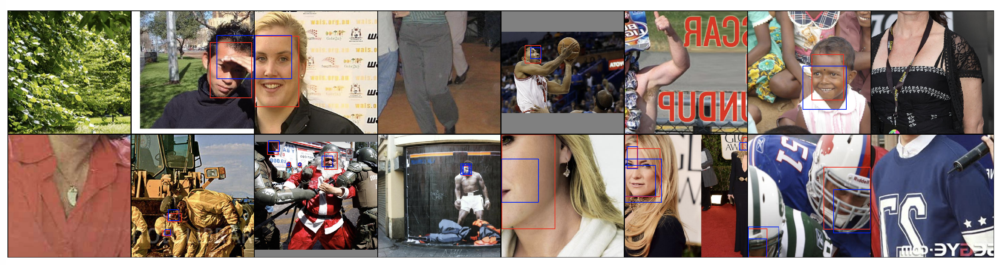
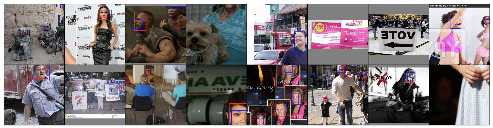
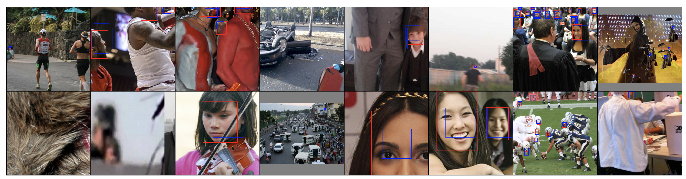

# SSD: Single Shot MultiBox Object Detector, in PyTorch
A [PyTorch](http://pytorch.org/) implementation of [Single Shot MultiBox Detector](http://arxiv.org/abs/1512.02325). Now the code only supports WiderFace for face detection.

## Installation
- Install [PyTorch](http://pytorch.org/)
- Clone this repository.
  * Note: The code is tested in Python 2.7.
- Then download the dataset.
- support [Visdom] (https://github.com/facebookresearch/visdom) to visulize prior boxes matching which can be used in selecting aspect ratio and scale.

## Training SSD on WiderFace

For now read the train2.py, test2.py and eval2.py.

Updating...
